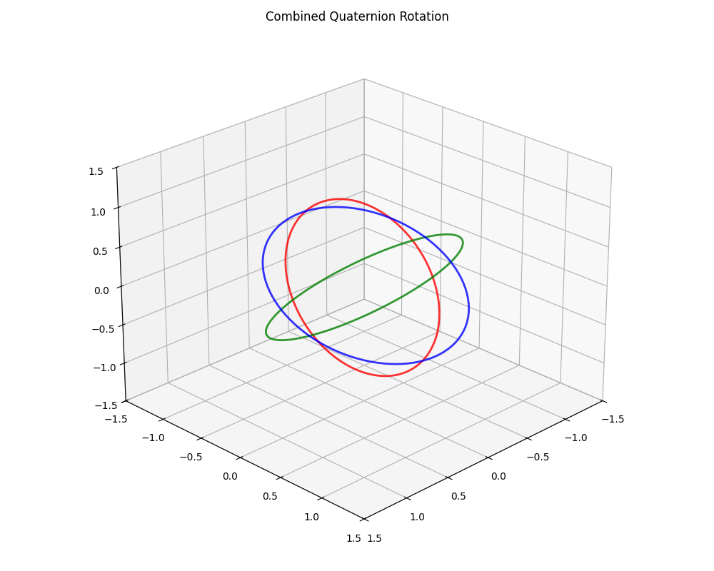

# 🔄 Quaternion Rotation Visualization



This project visualizes **combined 3D rotations** using **quaternions** to demonstrate smooth and stable transformations without suffering from **gimbal lock**, a limitation of Euler-based rotation systems.

## 📌 What It Does

* Animates three orthogonal rings (XY, YZ, XZ planes)
* Applies a continuously changing rotation using **quaternions** around the X, Y, and Z axes
* Shows how quaternion multiplication preserves smooth orientation updates, even with compound rotations

## 🧠 Why Quaternions?

Quaternions are ideal for 3D rotations because they:

* Avoid gimbal lock
* Enable smooth interpolation (SLERP)
* Are more numerically stable over time compared to Euler angles

This animation uses a combined rotation in the order **Z × Y × X**, visualized through quaternion multiplication.

## 📜 Historical Context

### Hamilton's Breakthrough (1843)

Irish mathematician **William Rowan Hamilton** discovered quaternions while seeking a 3D extension of complex numbers. His famous insight, carved into **Broom Bridge** in Dublin, led to the identity:

$$i^2 = j^2 = k^2 = ijk = -1$$

From this identity, the full multiplication rules derive:

$$
\begin{aligned}
ij &= k, & ji &= -k, \\
jk &= i, & kj &= -i, \\
ki &= j, & ik &= -j
\end{aligned}
$$

Initially used in physics (e.g., Maxwell's electromagnetism), quaternions were later supplanted by **vector calculus** (Gibbs/Heaviside) before their 20th century revival in:

* 🚀 Aerospace (attitude control)
* 🤖 Robotics (orientation interpolation)
* 🎮 Computer graphics (camera rotations)

---

## 🔢 Quaternion Definition

A quaternion is a **4D hypercomplex number**:

$$ \mathbf{q} = w + xi + yj + zk \quad \text{or} \quad \mathbf{q} = (w, \mathbf{v}) $$

where:

* **Scalar part**: $w$ (real component)
* **Vector part**: $\mathbf{v} = (x, y, z)$ (imaginary components)

### 🔧 Key Properties

1. **Multiplication Rules**
   * **Non-commutative**: $\mathbf{p}\mathbf{q} \neq \mathbf{q}\mathbf{p}$ → order matters
   * **Associative**: $(\mathbf{p}\mathbf{q})\mathbf{r} = \mathbf{p}(\mathbf{q}\mathbf{r})$ → stable chaining

2. **Rotation Encoding**
   A **unit quaternion** ($\|\mathbf{q}\| = 1$) encodes a rotation by angle $\theta$ around the rotation axis

   $\mathbf{u} = (u_x, u_y, u_z)$ ($\|\mathbf{u}\| = 1$) as:

   $$\mathbf{q} = \cos\left(\frac{\theta}{2}\right) + \sin\left(\frac{\theta}{2}\right)(u_x i + u_y j + u_z k)$$

   The $\theta/2$ term enables smooth interpolation (SLERP) and avoids double-covering.

---

## 🛠️ Requirements

```bash
pip install numpy matplotlib numpy-quaternion
```

> Note: `numpy-quaternion` is a separate package from NumPy.

---
