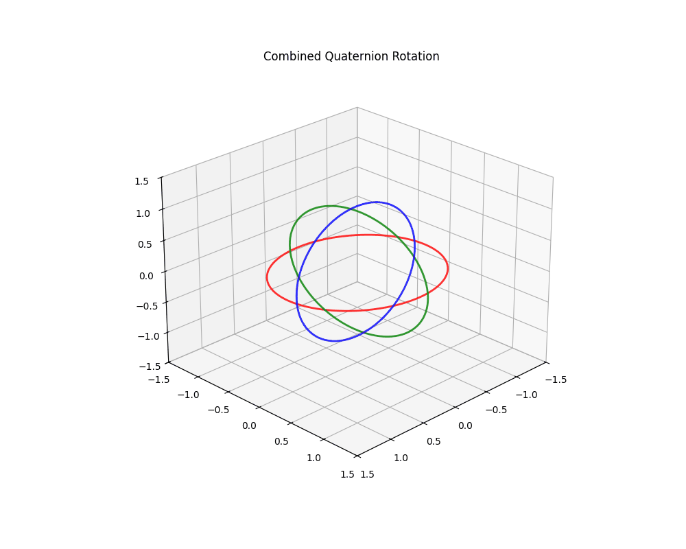

# 🔄 Quaternion 3D Rotation: A Gimbal-Lock-Free Solution

A visualization of smooth 3D rotations using quaternion math



## 📌 What It Does

* Animates three orthogonal rings (XY, YZ, XZ planes)
* Applies a continuously changing rotation using **quaternions** around the X, Y, and Z axes
* Demonstrates how quaternion multiplication preserves smooth orientation updates, avoiding gimbal lock

## 🧠 Why Quaternions?

Quaternions outperform Euler angles in 3D rotations because they:

* Avoid gimbal lock (no sudden alignment of axes)
* Enable smooth interpolation (SLERP)
* Are numerically stable for long-duration animations

This animation uses a combined rotation in the order Z × Y × X, showcasing seamless transitions.

## 📜 Historical Context

### Hamilton's Breakthrough (1843)

"William Rowan Hamilton, an Irish mathematician, was both formally educated at Trinity College Dublin and largely self-taught, combining his academic studies with a deep personal passion for mathematics. This self-directed approach led him to discover quaternions while attempting to generalize complex numbers into triplets of the form $a + bi + cj$. Though this seemed a natural extension from two to three dimensions, he found consistent multiplication rules impossible to define. His breakthrough came on October 16, 1843, near Dublin’s Broom Bridge, when he realized that four terms were needed. Introducing $k = ij$ as the product of the first two imaginary units, he created quaternions $(a + bi + cj + dk)$, governed by:"

$$i^2 = j^2 = k^2 = ijk = -1$$

These fundamental relations lead to the non-commutative multiplication rules:

$$
\begin{aligned}
ij &= k, & ji &= -k, \\
jk &= i, & kj &= -i, \\
ki &= j, & ik &= -j
\end{aligned}
$$

The solution preserved algebraic consistency at the cost of commutativity — making quaternions mathematics’ first successful extension of complex numbers into higher dimensions.

Initially used in physics (e.g., Maxwell’s electromagnetism), quaternions were later eclipsed by vector calculus (Gibbs/Heaviside) for simplicity. Their 20th-century revival cemented their role in:

* 🚀 Aerospace (attitude control)
* 🤖 Robotics (orientation interpolation)
* 🎮 Computer graphics (camera rotations)

---

## 🔢 Quaternion Definition

A quaternion is a **4D hypercomplex number**:

$$ \mathbf{q} = w + xi + yj + zk \quad \text{or} \quad \mathbf{q} = (w, \mathbf{v}) $$

where:

* **Scalar part**: $w$ (real component)
* **Vector part**: $\mathbf{v} = (x, y, z)$ (imaginary components)

### 🔧 Key Properties

1. **Multiplication Rules**
   * **Non-commutative**: $\mathbf{p}\mathbf{q} \neq \mathbf{q}\mathbf{p}$ → order matters
   * **Associative**: $(\mathbf{p}\mathbf{q})\mathbf{r} = \mathbf{p}(\mathbf{q}\mathbf{r})$ → stable chaining

2. **Rotation Encoding**

   A **unit quaternion** ($\|\mathbf{q}\| = 1$) encodes a rotation by angle $\theta$ around axis

   $\mathbf{u} = (u_x, u_y, u_z)$ where ($\|\mathbf{u}\| = 1$) as:

   $$\mathbf{q} = \cos\left(\frac{\theta}{2}\right) + \sin\left(\frac{\theta}{2}\right)(u_x i + u_y j + u_z k)$$

   The $\theta/2$ term enables smooth interpolation (SLERP) and avoids double-covering.

---

## 🛠️ Requirements

```bash
pip install numpy matplotlib numpy-quaternion
```

> Note: `numpy-quaternion` is a separate package from NumPy.

---
